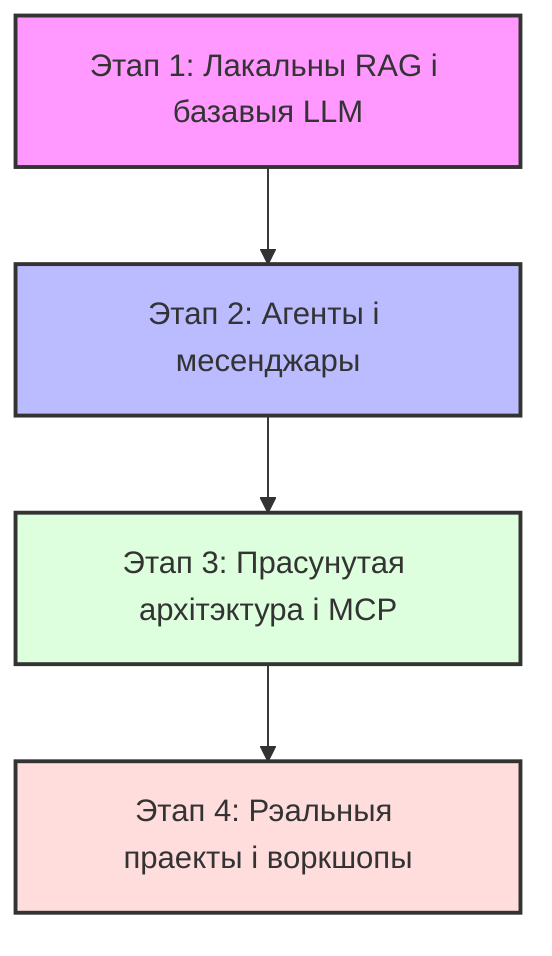

# 🎓 Практычны курс: RAG і AI-агенты на TypeScript & Bun

Вітаем у практычным курсе па распрацоўцы інтэлектуальных сістэм! Гэты рэпазіторый — поўнае кіраўніцтва і набор гатовых праектаў, якія пакажуць вам шлях ад базавых скрыптоў да складаных агентурных сістэм.

Увесь курс напісаны на **TypeScript** з выкарыстаннем хуткага і сучаснага рантайму **Bun**. Працоўная мова прыкладаў, промптаў і дакументацыі — **беларуская**.

---

## 🚀 Асноўныя тэхналогіі курса (Tech Stack)

Мы выкарыстоўваем сучасны і эфектыўны набор інструментаў распрацоўкі:

*   **Рантайм і распрацоўка:** [Bun](https://bun.sh) (хуткі запуск `.ts` файлаў, убудаваны менеджэр пакетаў і тэст-ранер).
*   **LLM і Вектарызацыя:**
    *   **Лакальна:** [Ollama](https://ollama.com) (запуск мадэляў накшталт Gemma 3, Llama 3 і Phi-4 непасрэдна на вашым камп'ютары).
    *   **Хмара:** OpenAI API (GPT-4o, GPT-5/o3-mini, Embeddings).
    *   **Google AI:** Gemini API (2.5-pro, Flash).
*   **Вектарны пошук:** [Qdrant](https://qdrant.tech) (высокапрадукцыйная вектарная база дадзеных для захавання і пошуку кантэксту па сэнсе).
*   **Фрэймворкі і логіка:** [LangChain v1](https://js.langchain.com/docs/) і [LangGraph](https://langchain-ai.github.io/langgraphjs/) (кіраванне ланцужкамі, структураваным вывадам і складанымі графамі з некалькімі агентамі).
*   **Інтэграцыя:** Telegram Bot API (`node-telegram-bot-api`), Discord.js, Model Context Protocol (MCP SDK).
*   **Франтэнд:** React і Vite (для паўнавартасных вэб-прыкладанняў у воркшопах).

---

## 🗺️ Дарожная карта курса (Roadmap)

Праграма навучання распрацавана па прынцыпе паступовага павелічэння складанасці:



### 📈 Чатыры асноўныя этапы:

1.  **Знаёмства з AI IDE і асновы RAG (Урокі 1–2):** Вучымся працаваць з AI-рэдактарамі (Cursor, Zed, VS Code з пашырэннямі), а таксама ствараць першыя RAG-сістэмы лакальна (Ollama + Phi-4) і ў хмары (OpenAI API).
2.  **Структураваны вывад і месенджары (Урокі 3–6):** Вучым мадэлі вяртаць дадзеныя ў строгім фармаце JSON (праз Zod-схемы). Будуем разумных ботаў у Telegram і Discord, якія ўмеюць карыстацца інструментамі (`Tools`) — хадзіць у Google, правяраць надвор'е ці аналізаваць малюнкі.
3.  **Канвееры і мультыагенты (Урокі 7–9):** Вывучаем сучасныя фрэймворкі. Спалучаем некалькі LLM у ланцужкі, ствараем уласны MCP-сервер і пішам складаныя графы ў LangGraph, дзе некалькі агентаў працуюць супольна.
4.  **Рэальныя воркшопы (Урокі 10–12):** Збіраем гатовыя рашэнні пад ключ — ад кансольных утыліт апрацоўкі Markdown да вялікага вэб-дадатку з React-інтэрфейсам, які робіць RAG-пошук па цэлай бібліятэцы PDF з убудаваным OCR (распазнаваннем тэксту на сканах).

---

## 📚 Спіс урокаў і спасылкі на матэрыялы

Кожная тэчка ўрока змяшчае свой падрабязны `README.md` з практычнымі заданнямі, камандамі для запуску і тлумачэннямі кода:

| Урок | Тэчка і спасылка | Тэма | Што вы пабудуеце |
| :--- | :--- | :--- | :--- |
| **0** | [lesson0_intro](file:///Users/serj/projects/lessons/RAG/lesson0_intro) | Уводзіны і наладка асяроддзя | Гід па наладцы IDE (VS Code, Zed або Cursor), усталёўцы Bun, Docker, Ollama і праграм. |
| **1** | [lesson1_ai_ide](file:///Users/serj/projects/lessons/RAG/lesson1_ai_ide) | Знаёмства з AI IDE | Эфектыўная праца з Cursor, Zed, VS Code + Cline/Continue, напісанне промптаў і гарачыя клавішы. |
| **2** | [lesson2_rag](file:///Users/serj/projects/lessons/RAG/lesson2_rag) | Базавы RAG (Лакальны і Хмарны) | Стварэнне сістэмы RAG у дзвюх частках: цалкам лакальна (Ollama + Phi-4) і з выкарыстаннем хмарных сэрвісаў (OpenAI). |
| **3** | [lesson3_formatted_result](file:///Users/serj/projects/lessons/RAG/lesson3_formatted_result) | Структураваны вывад | Telegram-бот для мадэрацыі чата, який адказвае строга ў JSON па Zod-схеме. |
| **4** | [lesson4_agent](file:///Users/serj/projects/lessons/RAG/lesson4_agent) | AI-агент з інструментамі | Telegram-бот, який сам прымае рашэнні аб выкліку функцый (надвор'е, пошук, выявы). |
| **5** | [lesson5_images](file:///Users/serj/projects/lessons/RAG/lesson5_images) | Vision і мультымадальнасць | Чат-бот, які аналізуе выявы, чытае тэкст на фота і робіць апісанне. |
| **6** | [lesson6_combined](file:///Users/serj/projects/lessons/RAG/lesson6_combined) | Агент у Discord | Разумны бот для Discord-сервера з захаваннем кантэксту размовы для кожнага юзера. |
| **7** | [lesson7_chain_models](file:///Users/serj/projects/lessons/RAG/lesson7_chain_models) | Ланцужкі задач (Chains) | Шматкрокавы канвеер перакладу, рэфератавання і лінгвістычнай карэктуры тэксту. |
| **8** | [lesson8_mcp](file:///Users/serj/projects/lessons/RAG/lesson8_mcp) | Распрацоўка MCP-сервера | Уласны сервер па пратаколе MCP для пашырэння здольнасцяў AI-рэдактараў кода. |
| **9** | [lesson9_langchain_graphs](file:///Users/serj/projects/lessons/RAG/lesson9_langchain_graphs) | LangChain і LangGraph | Мультыагентурная сістэма: кааперацыя агентаў-даследчыкаў, аўтараў і рэдактараў. |
| **10** | [lesson10_workshop](file:///Users/serj/projects/lessons/RAG/lesson10_workshop) | Воркшоп: MD-рэцэнзент | Кансольны CLI-інструмент для праверкі стылістыкі і граматыкі тэкстаў у Markdown. |
| **11** | [lesson11_workshop_rag_chat](file:///Users/serj/projects/lessons/RAG/lesson11_workshop_rag_chat) | Воркшоп: Вялікі RAG-чат | Fullstack вэб-чат па бібліятэцы кніг (PDF) з React-франтэндам і OCR-апрацоўкай сканаў. |
| **12** | [lessons12_skills](file:///Users/serj/projects/lessons/RAG/lessons12_skills) | Agent Skills | Пакаванне гатовай логікі агента ў модульныя скілы для пераносу паміж праектамі. |

---

## 🛠️ Што трэба зрабіць перад пачаткам (Quick Start)

1.  **Усталюйце Bun** (JavaScript і TypeScript рантайм):
    *   **macOS / Linux:** `curl -fsSL https://bun.sh/install | bash`
    *   **Windows:** `powershell -c "irm bun.sh/install.ps1 | iex"`
2.  **Усталюйце Docker Desktop** (патрэбен для запуску лакальнай базы дадзеных Qdrant):
    *   Спампуйце з [docker.com](https://www.docker.com/products/docker-desktop/).
3.  **Клануйце рэпазіторый і перайдзіце ў патрэбны ўрок:**
    ```bash
    git clone <спасылка_на_рэпазіторый>
    cd RAG
    cd lesson2_rag  # ці любы іншы ўрок
    bun install
    ```
4.  Падрабязнае апісанне па наладцы асяроддзя, API-ключоў і выбары зручнага AI-рэдактара (VS Code, Zed або Cursor) чытайце ў [Уводзінах (Урок 0)](file:///Users/serj/projects/lessons/RAG/lesson0_intro).

---

## 🎯 Мэты курса: чаму вы навучыцеся

Гэты курс выхадзіць далёка за межы простых тэорый пра RAG. Галоўная мэта — навучыць вас **будаваць сучасныя AI-native прыкладанні** і эфектыўна інтэграваць магчымасці вялікіх моўных мадэлей (LLMs) у рэальныя прадукты і працоўныя працэсы.

Пасля завяршэння курса вы зможаце:

*   **Распрацоўваць рэальныя AI-native дадаткі:** інтэграваць LLM у розныя інтэрфейсы (CLI-інструменты, Telegram-боты, Discord-боты, full-stack React вэб-прыкладанні).
*   **Кіраваць паводзінамі LLM праз структураваны вывад (Structured Outputs):** упэўнена выкарыстоўваць JSON-схемы і Zod для атрымання прадказальных і валідаваных дадзеных ад штучнага інтэлекту, што дазваляе звязваць тэкставы вывад LLM з традыцыйным кодам.
*   **Праектаваць аўтаномных AI-агентаў:** даваць мадэлям магчымасць прымаць рашэнні, будаваць пакрокавыя планы і выкарыстоўваць інструменты (выклік знешніх API, чытанне/запіс файлаў, выкананне вылічэнняў).
*   **Будаваць складаную агентурную логіку (Multi-Agent Systems):** выкарыстоўваць сучасныя падыходы і фрэймворкі накшталт LangGraph для стварэння сістэм з некалькіх агентаў, якія ўзаемадзейнічаюць паміж сабой, маюць агульную памяць і выпраўляюць памылкі адзін аднаго.
*   **Пашыраць магчымасці распрацоўкі праз MCP (Model Context Protocol):** ствараць уласныя MCP-серверы для падключэння сваіх баз дадзеных і API непасрэдна ў AI-рэдактары (Cursor, Zed, VS Code), каб штучны інтэлект дапамагаў вам пісаць код з улікам вашага асабістага кантэксту.
*   **Працаваць з кантэкстам і RAG-сістэмамі:** разумна апрацоўваць вялікія аб'ёмы дакументаў (сегментацыя, чанкінг, стварэнне эмбедынгаў, вектарны пошук у Qdrant) і забяспечваць LLM дакладнай інфармацыяй без галюцынацый.
*   **Аптымізаваць працу з LLM (Ollama & Cloud APIs):** разумець розніцу паміж хмарнымі і лакальнымі мадэлямі, выбіраць эфектыўныя мадэлі для канкрэтных задач і балансаваць паміж хуткасцю, цаной і прыватнасцю дадзеных.

---

Удачы ў навучанні! Пачніце з [Урока 0](file:///Users/serj/projects/lessons/RAG/lesson0_intro) і паступова рухайцеся наперад!

